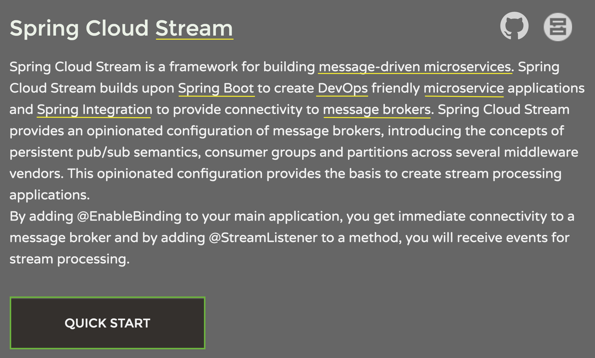

<!--.slide: data-background="img/background-green-16x9.png" -->

### http://cloud.spring.io/spring-cloud-stream/

            
---
<!--.slide: data-background="img/background-green-16x9.png" -->

### ~~Buzzword Bingo~~
### Quick Context!

- Streams
- Microservice
- Message-Driven
- DevOps
- Spring Boot
- Spring Integration

<aside class="notes" data-markdown>
</aside>

---
<!--.slide: data-background="img/background-green-16x9.png" -->

### Streams

---
<!--.slide: data-background="img/background-green-16x9.png" -->

### Spring Integration

Message Broker (Kafka)

---
<!--.slide: data-background="img/background-green-16x9.png" -->

### Spring Boot 

Live Demo
